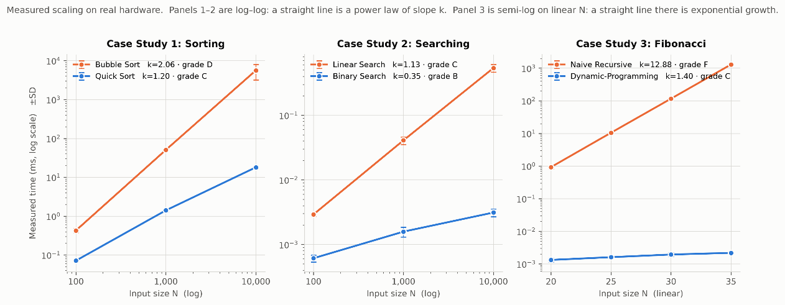
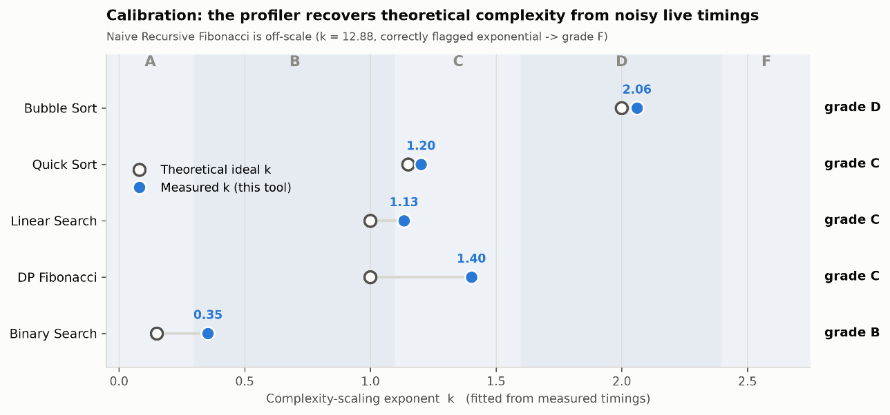
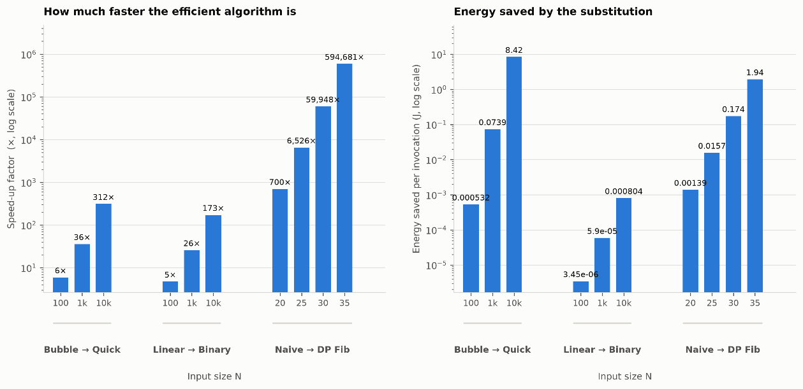

# Green Code Profiler

Most profilers report milliseconds. This one reports joules and grams of CO₂e, and grades the result.

Green Code Profiler measures the **latency** and **memory footprint** of any runnable command, converts them into an operational **Software Carbon Intensity (SCI)** figure, and assigns an A–F sustainability grade derived from the workload's empirically fitted complexity-scaling exponent. It profiles from the outside via kernel APIs, so the target can be a Python script, a compiled binary, a Node process, or a model training run.

Energy and carbon are **model estimates, not wall-socket measurements**. The model, its coefficients, and its failure modes are documented in [Methodology](#methodology) and [Limits](#limits).

Built as an IS2 research project at Khon Kaen Wittayayon School, academic year 2569. Python 3.9+, MIT licensed, tested on Windows 11 and Linux.

📖 [อ่านฉบับภาษาไทย (Thai README)](README.md) · 📑 [Proof of Concept dossier](docs/GREEN_PROFILER_POC.md)

---

## Features

- **Dual measurement paths.** `perf_bench.py` profiles an isolated child process through [`psutil`](#references) (RSS, CPU%), requiring no source instrumentation and imposing no language constraint. `algo_lab.py` profiles in-process through [`tracemalloc`](#references), which attributes peak heap to the algorithm and excludes the interpreter baseline.
- **Adaptive sampling.** 1 ms base interval, with a spinlock mode below 0.2 ms to bypass the ~15.6 ms Windows scheduler timer floor. RSS deltas above a threshold trigger 10× oversampling to catch transient allocation spikes that a 1 Hz sampler misses entirely.
- **Statistical controls.** Up to 30 trials per cell under a per-cell wall-time budget, warm-up trial isolated from the steady-state aggregate, pre-spawn baseline subtraction, z-score outlier rejection, and 95% confidence intervals with a reported coefficient of variation.
- **SCI operational accounting.** Latency and memory footprint are converted to joules, then to gCO₂e using a configurable grid intensity factor.
- **Grade from scaling, not from constants.** The A–F band is assigned from the exponent of a power-law fit across input sizes, making it robust to the choice of energy coefficients and to the host machine.
- **Big-O validation.** Fitted exponents are reported alongside theoretical complexity and fit quality (R²), so the measurement can be checked against the analysis rather than trusted.
- **External calibration harness.** `calibrate_external.py` regresses measured peak memory against the Win32 `GetProcessMemoryInfo` kernel counter.
- **Flask dashboard** for interactive runs and result browsing.

---

## Architecture

Three tiers, each independently testable and independently replaceable.

```
Tier 3 — Presentation     perf_bench_server.py  ·  templates/dashboard.html
                          Flask server, run submission, result rendering
                                        ▲
Tier 2 — Analysis         green_metrics.py
                          latency + memory → power → energy → carbon → grade
                                        ▲
Tier 1 — Instrumentation  perf_bench.py (external, psutil)
                          algo_lab.py   (in-process, tracemalloc)
```

Tier 1 emits raw observations only. Tier 2 owns every coefficient and every threshold. Tier 3 renders. Swapping the grid intensity factor or the power model touches one file.

---

## Methodology

### Energy model

Per measurement, with `active_cores = cpu_percent / 100`:

```
P_cpu   = (TDP / cores) · (s + (1 − s) · min(active_cores, 1)) · active_cores     [W]
P_ram   = 0.392 · mem_GB                                                          [W]
E       = (P_cpu + P_ram) · t                                                      [J]
C       = E / 3.6e6 · I                                                            [gCO₂e]
```

`s` is the static power fraction (default 0.30), modelling the SPECpower curve shape where a lit core draws non-trivial power even at low utilisation. The RAM coefficient of 0.392 W/GB is the Cloud Carbon Footprint memory figure (0.000392 kWh/GB-hour) restated as power. `I` is grid carbon intensity: 475 gCO₂e/kWh (IEA global average, the default, chosen for comparability with published SCI work) or 500 gCO₂e/kWh for the Thai national grid per TGO.

This implements the operational term of the SCI specification:

```
SCI = (E · I) + M     per functional unit
```

Embodied carbon `M` is fixed at 0. A runtime profiler observes execution; it has no visibility into manufacturing amortisation, and inventing a value would be worse than declaring the omission.

### Grading

The primary score is the exponent `k` of a power-law fit of the metric against input size. Because `k` is a property of the algorithm rather than of the host, the grade is stable across machines and across coefficient choices — only the absolute joule figure moves.

| Grade | Fitted exponent | Complexity class | Verdict |
|:---:|---|---|---|
| A | k < 0.30 | O(1), O(log n) | Near-constant scaling |
| B | 0.30 ≤ k < 1.10 | O(n) | Linear |
| C | 1.10 ≤ k < 1.60 | O(n log n) | Log-linear |
| D | 1.60 ≤ k < 2.40 | O(n²) | Quadratic |
| F | k ≥ 2.40 | O(n³⁺), exponential | Super-quadratic |

---

## Empirical Results

Measured on an Intel Core i5-1235U under Windows 11. Energy model: TDP 15 W across 10 physical cores, grid intensity 500 gCO₂e/kWh (TGO).

### Algorithm pairs

| Pair | n | Speedup | Energy reduction | Grade |
|---|---:|---:|---:|:---:|
| Bubble Sort → Quick Sort | 10,000 | 312× | 99.68 % | D → C |
| Linear Search → Binary Search | 10,000 | 173× | 99.42 % | C → B |
| Naive Recursive → DP Fibonacci | 35 | 594,681× | > 99.99 % | F → C |

Fibonacci is compared at n = 35 because the naive recursive variant is not tractable beyond it; the DP variant was additionally measured to n = 100,000.

### Big-O validation

Fitted exponent against theoretical complexity, with power-law fit quality:

| Algorithm | Theoretical | Fitted k | R² | Grade |
|---|---|---:|---:|:---:|
| Bubble Sort | O(n²) | 2.06 | 0.9999 | D |
| Quick Sort | O(n log n) | 1.20 | 0.9980 | C |
| Linear Search | O(n) | 1.13 | 0.9999 | C |
| Binary Search | O(log n) | 0.35 | 0.9911 | B |
| Naive Recursive Fibonacci | O(φⁿ) | 12.88 | 0.9934 | F |
| DP Fibonacci | O(n) | 1.40 | 0.9873 | C |

Two honest caveats. Linear Search fits k = 1.13, marginally over the B/C boundary at 1.10 — constant per-element overhead inflates the exponent at these input sizes, and the grade is empirical rather than theoretical. For the naive Fibonacci, a power-law exponent is not a meaningful description of exponential growth; the fit is reported because the band assignment (F) is correct regardless, and a semi-log fit is computed alongside it to identify the exponential case.





### Memory calibration against the kernel

Measured peak memory regressed against the Win32 `GetProcessMemoryInfo` → `PeakWorkingSetSize` counter over 25–400 MB workloads:

```
ours = 0.9978 × kernel + 2.04 MB        R² = 1.0000,  Pearson r = 1.0000
```

The ~2 MB intercept is the profiler's own resident overhead and is subtracted as baseline.

### Scale of the effect

Substituting Quick Sort for Bubble Sort at n = 10,000, invoked 10⁶ times per day, saves **854 kWh/year ≈ 0.43 tCO₂e/year** at the Thai grid factor.



---

## Quick Start

```bash
pip install -r requirements.txt
```

Run the built-in algorithm case studies. `--cores`, `--tdp`, and `--grid` set the energy model to your hardware and electricity grid:

```bash
python algo_lab.py --budget 8 --cores 10 --tdp 15 --grid 500
```

Regenerate figures from the resulting dataset. With no argument it reads `results/case_studies.json` (falling back to `results/case_studies_full.json`); pass an explicit path to override. Figure 3 needs the full run, not `--quick`:

```bash
python make_figures.py
python make_figures.py results/my_dataset.json     # explicit path
```

Serve the live dashboard at `http://127.0.0.1:5000`. Enter a command in **Target Command** and press **Run Benchmark**; progress, per-trial figures, energy, carbon, and the environment panel update as the run proceeds:

```bash
python perf_bench_server.py --host 127.0.0.1 --port 5000
```

To view a previously saved report instead of running a new benchmark, use the standalone viewer:

```bash
python perf_bench.py --output results.json -- python heavy_math.py
python app.py --report results.json
```

Verify the memory instrumentation against the OS kernel counter:

```bash
python calibrate_external.py
```

Useful `algo_lab.py` flags: `--trials` (max per cell, default 30), `--min-trials` (default 8), `--budget` (per-cell wall-time budget in seconds), `--zthr` (outlier z-threshold), `--quick` (reduced sizes for a smoke run).

---

## Custom Measurement

The profiler measures a **running process**, not a source file. Pass the command that starts your program after `--`:

```bash
python perf_bench.py -- python your_program.py
```

```bash
python perf_bench.py --trials 7 -- python train_model.py --epochs 5
```

The target is spawned with `subprocess.Popen` on a structured argument list — never `shell=True` — so behaviour is identical across platforms. Any executable resolvable on `PATH` works, which makes the tool language-agnostic: `node app.js`, a compiled `.exe`, or a shell-invoked binary are all valid targets. On Windows, prefer absolute paths.

To extract a figure of merit from the target's own stdout, point the accuracy regex at it:

```bash
python perf_bench.py --accuracy-pattern "val_acc[:=\s]+([0-9.]+)" -- python train.py
```

The same command can be entered in the dashboard's **Target Command** field.

---

## Limits

**Measurement scope**
- The external profiler treats the target as a black box. It reports whole-process cost and will not attribute consumption to a specific function or line.
- `algo_lab.py` covers the six built-in Python algorithms; adding others requires editing the harness.
- For ML workloads it observes runtime resources only. It does not analyse parameter counts or FLOPs.
- Targets completing in microseconds approach the clock resolution floor and the process-spawn overhead, which dominates the reading. Increase the workload or read the target's own internal timing.

**Model fidelity**
- Energy and carbon are derived from a coefficient model, not measured at the socket. Absolute joules scale linearly with `--tdp`, `--cores`, and `--grid`; set them for your hardware and grid, or the magnitudes are meaningless.
- Relative results — percentage saved, and the A–F grade — are insensitive to those coefficients, because the grade is fitted from scaling behaviour. This is the figure to cite.
- Embodied carbon is excluded by construction, so the reported SCI is the operational term only and understates full lifecycle impact.

**Environment**
- Verified on Windows 11 and Linux. The macOS path is implemented but not validated.
- `calibrate_external.py` needs the Win32 `GetProcessMemoryInfo` API on Windows, or GNU `/usr/bin/time` on Linux/macOS.
- `perf_bench_server.py` and its dashboard are fully self-contained and run offline. `app.py` loads charting libraries from a CDN and requires network access.

**Repository scope**
- The C++/ESP32 case-study sources referenced in the report (Table 4.6) are not published in this repository; representative excerpts appear in the report's Appendix D.

---

## Repository Layout

```
green-code-profiler/
├── algo_lab.py             # Tier 1 — in-process algorithm harness (tracemalloc)
├── perf_bench.py           # Tier 1 — isolated-process profiler (psutil)
├── green_metrics.py        # Tier 2 — power, energy, carbon, grading
├── perf_bench_server.py    # Tier 3 — Flask server, live runs
│   └── templates/
│       └── dashboard.html  #          dashboard page (self-contained, no CDN)
├── app.py                  # Tier 3 — standalone viewer for a saved JSON report
├── calibrate_external.py   # kernel-counter calibration harness
├── make_figures.py         # publication figures from measured data
├── heavy_math.py           # sample target workload
├── results.json            # sample report, for `python app.py --report results.json`
├── results/                # datasets (JSON), tables (Markdown), figures/
├── docs/                   # proof-of-concept dossier and images
├── requirements.txt
├── README.md               # Thai (primary)
└── README.en.md            # this file
```

---

## References

Green Software Foundation. *Software Carbon Intensity (SCI) Specification*, v1.0. Standardised as ISO/IEC 21031:2024. https://sci.greensoftware.foundation

Schwartz, R., Dodge, J., Smith, N. A., & Etzioni, O. (2020). Green AI. *Communications of the ACM*, 63(12), 54–63. https://doi.org/10.1145/3381831

Cormen, T. H., Leiserson, C. E., Rivest, R. L., & Stein, C. (2022). *Introduction to Algorithms* (4th ed.). MIT Press.

Thailand Greenhouse Gas Management Organization (TGO). *Emission Factor of Thailand's National Grid Electricity.* Used as the 500 gCO₂e/kWh grid intensity factor.

International Energy Agency. *Global average grid carbon intensity.* Basis for the 475 gCO₂e/kWh default.

Cloud Carbon Footprint. *Methodology: Memory Coefficient* (0.000392 kWh/GB-hour). Basis for the 0.392 W/GB RAM term.

Python Software Foundation. *tracemalloc — Trace memory allocations.* Python Standard Library documentation.

Rodolà, G. *psutil: Cross-platform process and system utilities.* https://github.com/giampaolo/psutil

---

## License

MIT — see [LICENSE](LICENSE).
