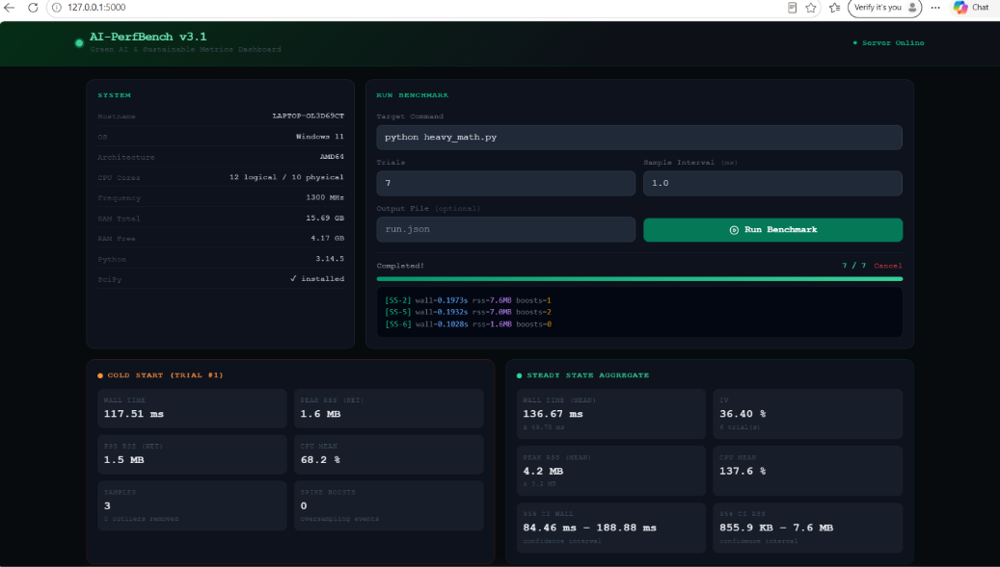
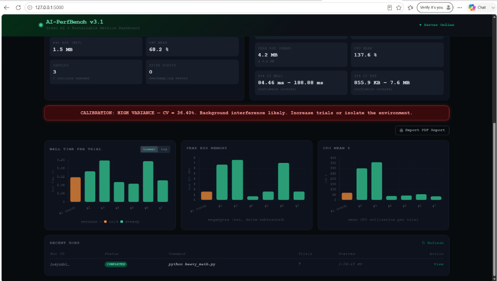

# 🌱 Green Code Profiler — เครื่องมือวัดความประหยัดพลังงานของโค้ด

> **ให้ "เกรด A–F" กับโค้ดของคุณ เหมือนฉลากประหยัดไฟเบอร์ 5**
> วัดว่าอัลกอริทึมแต่ละแบบใช้เวลา หน่วยความจำ พลังงาน และปล่อยคาร์บอนเท่าไร แล้วบอกว่า "ประหยัด" หรือ "เปลือง"

*A tool that measures how much time, memory, energy, and CO₂ an algorithm uses — then gives it an A–F sustainability grade, like an energy-efficiency label for code.*

โครงงานวิชา IS2 (การสื่อสารและการนำเสนอ) · โรงเรียนขอนแก่นวิทยายน · ปีการศึกษา 2569
พัฒนาด้วย **Python** · ทำงานบน Windows / macOS / Linux · โอเพนซอร์ส (MIT)

📖 [English README](README.en.md) · 📑 [เอกสารเชิงลึก (Proof of Concept)](docs/GREEN_PROFILER_POC.md)

---

## 🎯 ปัญหาที่แก้ (The Problem)

ทุกครั้งที่โปรแกรมทำงาน มันกินไฟฟ้าและหน่วยความจำ แต่คนเขียนโค้ดส่วนใหญ่ **มองไม่เห็น** ว่าโค้ดของตัวเองเปลืองแค่ไหน และไม่มีเครื่องมือง่าย ๆ ที่บอกออกมาเป็น "ค่าไฟ" หรือ "คาร์บอน" ที่เข้าใจได้ทันที การเลือกอัลกอริทึมที่ไม่ดีจึงทำให้สิ้นเปลืองพลังงานโดยไม่จำเป็น ซึ่งเมื่อคูณด้วยผู้ใช้จำนวนมาก กลายเป็นการปล่อยคาร์บอนมหาศาล

**Green Code Profiler** แก้ปัญหานี้ด้วยวิธีที่เรียบง่าย: วัดโค้ด → แปลงเป็นพลังงาน/คาร์บอน → ให้เกรด A–F ที่ใครก็เข้าใจ

---

## ⚡ เริ่มใช้ใน 3 นาที (Quick Start)

```bash
# 1. ติดตั้ง (ต้องมี Python 3.9 ขึ้นไป)
pip install -r requirements.txt

# 2. ลองรันตัวอย่างสำเร็จรูป — เห็นเกรด A–F ทันที (~1 นาที)
python algo_lab.py --quick

# 3. เปิดแดชบอร์ดบนเว็บ แล้วเข้า http://127.0.0.1:5000
python perf_bench_server.py --host 127.0.0.1 --port 5000
```

---

## ✨ ทำอะไรได้บ้าง (Features)

- ⏱️ **วัดเวลา (Latency)** ระดับนาโนวินาที และ **หน่วยความจำ (RAM)** ที่โค้ดใช้จริง
- 🔋 **แปลงเป็นพลังงาน (จูล)** และ **คาร์บอน (gCO₂e)** ตามมาตรฐาน Software Carbon Intensity
- 🏷️ **ให้เกรด A–F** ตามอัตราการเติบโตของทรัพยากร (เหมือนฉลากเบอร์ 5)
- 📊 **แดชบอร์ดบนเว็บ** สั่งวัดและดูผลแบบเรียลไทม์
- ✅ **พิสูจน์ความแม่นยำ** ได้เอง โดยเทียบกับตัวนับของระบบปฏิบัติการ (R² = 1.0000)
- 🔬 **ควบคุมความคลาดเคลื่อน** ด้วยการทดสอบซ้ำ 30 รอบ ลบค่าฐาน และตัดค่าผิดปกติ

---

## 🏗️ สถาปัตยกรรม 3 ชั้น (3-Tier Architecture)

```
┌────────────────────────────────────────────────────────────┐
│  ชั้นที่ 3: แสดงผล                                            │
│    perf_bench_server.py + templates/dashboard.html          │
│    (สั่งวัด + ดูผลสด)                                          │
│    app.py  (เปิดดูไฟล์ผลลัพธ์ที่บันทึกไว้)                        │
└──────────────────────────▲─────────────────────────────────┘
┌──────────────────────────┴─────────────────────────────────┐
│  ชั้นที่ 2: คำนวณ    green_metrics.py                         │
│    (เวลา + แรม → พลังงาน → คาร์บอน → เกรด A–F)                 │
└──────────────────────────▲─────────────────────────────────┘
┌──────────────────────────┴─────────────────────────────────┐
│  ชั้นที่ 1: วัดผล                                             │
│    algo_lab.py    (วัดในกระบวนการ, tracemalloc)               │
│    perf_bench.py  (วัดจากภายนอก, psutil — ไม่จำกัดภาษา)         │
└────────────────────────────────────────────────────────────┘
```

ชั้นที่ 1 ส่งออก "ค่าดิบ" อย่างเดียว · ชั้นที่ 2 เป็นเจ้าของค่าสัมประสิทธิ์ทั้งหมด · ชั้นที่ 3 แค่แสดงผล
การเปลี่ยนค่าคาร์บอนหรือแบบจำลองพลังงานจึงกระทบไฟล์เพียงไฟล์เดียว

---

## 📌 วิธีใช้งาน 3 แบบ

### โหมด A — เปรียบเทียบอัลกอริทึมสำเร็จรูป

รันได้ทันทีไม่ต้องเตรียมไฟล์ วัด 6 อัลกอริทึมที่มีในตัว

```bash
python algo_lab.py --budget 8 --cores 10 --tdp 15 --grid 500
```

| ตัวเลือก | ความหมาย | ค่าเริ่มต้น |
|---|---|---|
| `--cores` | จำนวนแกน CPU เชิงกายภาพของเครื่อง | 10 |
| `--tdp` | กำลังไฟ CPU (วัตต์) | 15 |
| `--grid` | ค่าคาร์บอนของไฟฟ้า (ไทย = 500 gCO₂e/kWh) | 500 |
| `--budget` | งบเวลาต่อจุดข้อมูล (วินาที) | 8 |
| `--quick` | รันแบบเร็วสำหรับทดลอง | – |

ผลลัพธ์จะถูกบันทึกที่ `results/case_studies.json` และ `results/case_studies_tables.md`

### โหมด B — วัดโปรแกรมอะไรก็ได้

เครื่องมือนี้ **วัด "โปรแกรมที่กำลังทำงาน" ไม่ใช่ไฟล์โค้ดเฉย ๆ** — ต้องบอก *"คำสั่งที่ใช้รันโปรแกรม"* ต่อท้าย `--`

```bash
python perf_bench.py -- python your_program.py
python perf_bench.py --trials 7 -- python train_model.py --epochs 5
python perf_bench.py --trials 12 --accuracy-pattern "time_ms=([0-9.]+)" -- ./my_program.exe
```

- **วัดได้:** โปรแกรมอะไรก็ได้ที่รันด้วยคำสั่ง — สคริปต์ Python, โมเดล AI, ไฟล์ `.exe`, `node app.js` ฯลฯ (วัดจากภายนอกจึงไม่จำกัดภาษา)
- 💡 บน Windows แนะนำใส่ path เต็มของโปรแกรม เพื่อกันปัญหาหาไฟล์ไม่เจอ
- ⚠️ การเรียกโปรเซสภายนอกมีต้นทุนเริ่มต้น ~110–165 ms ถ้าโปรแกรมเสร็จเร็วกว่านี้ ให้เพิ่มปริมาณงาน หรือใช้ `--accuracy-pattern` ดึงเวลาที่โปรแกรมวัดเอง

ลองกับตัวอย่างที่ให้มาได้: `python perf_bench.py -- python heavy_math.py`

### โหมด C — แดชบอร์ดบนเว็บ

```bash
python perf_bench_server.py --host 127.0.0.1 --port 5000
```

เปิดเบราว์เซอร์ไปที่ `http://127.0.0.1:5000` แล้วพิมพ์คำสั่ง เช่น `python your_program.py` ลงในช่อง
**Target Command** → กด **Run Benchmark** จะเห็นความคืบหน้าแบบสด พร้อมเวลา หน่วยความจำ พลังงาน คาร์บอน และกราฟรายรอบ




**อีกทางเลือกหนึ่ง** — ถ้าต้องการแค่เปิดดูไฟล์ผลลัพธ์ที่บันทึกไว้แล้ว (ไม่สั่งวัดใหม่) ใช้ `app.py`:

```bash
python perf_bench.py --output results.json -- python heavy_math.py
python app.py --report results.json      # แล้วเปิด http://127.0.0.1:5000
```

---

## 📊 ผลการทดลอง (Results)

เปรียบเทียบอัลกอริทึม "แบบธรรมดา" กับ "แบบฉลาด" 3 คู่
(วัดจริงบน Intel Core i5-1235U, Windows 11, ค่าไฟฟ้าไทย 500 gCO₂e/kWh)

| คู่ที่ทดสอบ | ขนาดข้อมูล | เร็วขึ้น | ประหยัดพลังงาน | เกรด |
|---|---:|---:|---:|:---:|
| Bubble → Quick Sort | 10,000 | **312 เท่า** | **99.68%** | D → C |
| Linear → Binary Search | 10,000 | **173 เท่า** | **99.42%** | C → B |
| Fibonacci เรียกซ้ำ → จำค่าไว้ | 35 | **594,681 เท่า** | **> 99.99%** | F → C |

**กราฟการเติบโตของเวลาเมื่อข้อมูลเพิ่มขึ้น** (เส้นชันกว่า = เปลืองกว่า)


**ผลที่วัดได้ตรงกับทฤษฎี Big-O** (จุดสีน้ำเงินคือค่าที่วัดได้ ตรงกับที่ทฤษฎีทำนาย)


**ผลด้านการประหยัด** — เปลี่ยน Bubble → Quick Sort ที่ระดับเรียกใช้ 1 ล้านครั้ง/วัน ประหยัดได้ ~854 kWh/ปี หรือ ~0.43 ตัน CO₂e/ปี


> 📎 ภาพทั้งสามอยู่ใน `results/figures/` เป็นผลที่วัดบนเครื่องอ้างอิง (Intel Core i5-1235U / Windows 11)
> ถ้าต้องการสร้างใหม่จากเครื่องของคุณเอง ให้รัน `python algo_lab.py` (แบบเต็ม ไม่ใส่ `--quick`) แล้วตามด้วย `python make_figures.py`

---

## 🏷️ เกรด A–F อ่านยังไง

เกรดคำนวณจาก **เลขชี้กำลังการขยายตัว (k)** ซึ่งได้จากการปรับเส้นโค้งแบบกำลังระหว่างขนาดข้อมูลกับทรัพยากรที่ใช้
เหตุผลที่เลือกตัวชี้วัดนี้คือ k เป็นสมบัติของอัลกอริทึมเอง จึงไม่เปลี่ยนตามเครื่องหรือค่าสัมประสิทธิ์

| เกรด | ช่วง k | ชั้นความซับซ้อน | ควรทำอะไร |
|:---:|---|---|---|
| **A** | k < 0.30 | O(1), O(log n) | ใช้งานได้ ไม่ต้องแก้ |
| **B** | 0.30 ≤ k < 1.10 | O(n) | ยอมรับได้ทั่วไป |
| **C** | 1.10 ≤ k < 1.60 | O(n log n) | ยอมรับได้สำหรับ sort/search |
| **D** | 1.60 ≤ k < 2.40 | O(n²) | ควรพิจารณาเปลี่ยนอัลกอริทึม |
| **F** | k ≥ 2.40 | O(n³) ขึ้นไป, exponential | ต้องแก้ก่อนใช้จริง |

---

## 🔬 เราพิสูจน์ว่าเครื่องมือวัดแม่นได้อย่างไร (Validation)

1. **เทียบกับตัวนับของระบบปฏิบัติการ** — เอาค่าหน่วยความจำที่วัดได้ ไปเทียบกับค่าที่เคอร์เนลบันทึกไว้เอง
   ได้สมการ `ค่าที่วัดได้ = 0.9978 × ค่าจากเคอร์เนล + 2.04 MB` โดยมี **R² = 1.0000**
   (ค่าคงที่ ~2 MB คือหน่วยความจำที่ตัวเครื่องมือเองใช้ ซึ่งถูกลบออกเป็นค่าฐาน)
   ```bash
   python calibrate_external.py
   ```
   > ต้องใช้ Win32 API บน Windows หรือ `/usr/bin/time` บน Linux/macOS

2. **เทียบกับทฤษฎี Big-O** — ค่าที่วัดได้ตรงกับทฤษฎี เช่น Bubble Sort ได้ k = 2.06 (ทฤษฎี 2.00)

3. **ทดสอบซ้ำได้ผลเดิม** — วัดซ้ำ 30 รอบ และรันคนละวัน เกรดออกมาเหมือนเดิมทุกครั้ง

---

## ⚠️ ข้อจำกัด (Limitations)

**สิ่งที่วัดได้ / วัดไม่ได้**
- ✅ วัดได้: โปรแกรมที่ "รันได้ด้วยคำสั่ง" รวมถึงโมเดล AI ขณะทำงาน
- ❌ วัดไฟล์โค้ดที่ไม่รันเองไม่ได้ — ต้องทำให้รันได้ก่อน
- โหมด A วัดเฉพาะ 6 อัลกอริทึมที่มีในตัว (Python) — เพิ่มอัลกอริทึมอื่นต้องแก้โค้ด
- โหมด B วัดทั้งโปรแกรมแบบ "กล่องดำ" — บอกภาพรวมได้ แต่ไม่เจาะว่าโค้ดบรรทัดใดกินทรัพยากร
- วัดโมเดล AI ได้เฉพาะทรัพยากรตอนรัน ไม่ได้วิเคราะห์พารามิเตอร์/FLOPs ภายใน

**ความแม่นยำ**
- ค่าพลังงานเป็น **ค่าประมาณจากการคำนวณ** ไม่ใช่การวัดจากมิเตอร์ไฟจริง — ควรตั้ง `--cores` `--tdp` `--grid` ให้ตรงกับเครื่องและประเทศที่ใช้
- โปรแกรมที่รันเร็วมาก (ระดับไมโครวินาที) อาจวัดคลาดเคลื่อน เพราะชนเพดานความละเอียดของนาฬิกา
- ผลลัพธ์หลัก (% ที่ประหยัด และเกรด A–F) **ไม่ขึ้นกับค่าสัมประสิทธิ์** ที่เลือก แต่ค่าจูลสัมบูรณ์ขึ้นกับการตั้งค่า
- คาร์บอนฝังตัว (embodied carbon) กำหนดเป็น 0 เพราะอยู่นอกขอบเขตของเครื่องมือที่วัดขณะรัน

**สภาพแวดล้อม**
- ทดสอบยืนยันแล้วบน **Windows 11** และ **Linux** (macOS ออกแบบรองรับไว้)
- แดชบอร์ด `perf_bench_server.py` ทำงานแบบออฟไลน์ได้ (ไม่ต้องต่อเน็ต)
- แดชบอร์ด `app.py` ต้องต่ออินเทอร์เน็ต เพราะโหลดไลบรารีกราฟจาก CDN

**ขอบเขตของรีโปนี้**
- ชุดกรณีศึกษาภาษา C++ / ESP32 ที่อยู่ในรายงาน (ตารางที่ 4.6) **ยังไม่ได้เผยแพร่ในรีโปนี้** — ตัวอย่างซอร์สโค้ดดูได้ในภาคผนวก ง ของรายงาน

---

## 📁 โครงสร้างไฟล์ (File Structure)

```
green-code-profiler/
├── algo_lab.py             # ชั้น 1: วัดอัลกอริทึมในกระบวนการ (tracemalloc)
├── perf_bench.py           # ชั้น 1: วัดทั้งโปรแกรมจากภายนอก (psutil)
├── green_metrics.py        # ชั้น 2: คำนวณพลังงาน / คาร์บอน / เกรด
├── perf_bench_server.py    # ชั้น 3: เซิร์ฟเวอร์แดชบอร์ด (Flask) — สั่งวัดสด
│   └── templates/
│       └── dashboard.html  #         หน้าเว็บแดชบอร์ด
├── app.py                  # ชั้น 3: แดชบอร์ดแบบเปิดดูไฟล์ผลลัพธ์ที่บันทึกไว้
├── calibrate_external.py   # ตรวจสอบความแม่นยำเทียบกับเคอร์เนลของ OS
├── make_figures.py         # สร้างกราฟจากผลการทดลอง
├── heavy_math.py           # โปรแกรมตัวอย่างไว้ลองวัด
├── results.json            # ตัวอย่างไฟล์ผลลัพธ์ (ใช้กับ app.py)
├── results/                # ผลการทดลอง (JSON, ตาราง) และกราฟใน figures/
├── docs/                   # เอกสารเชิงลึกและภาพประกอบ
├── requirements.txt
├── README.md               # ไฟล์นี้ (ภาษาไทย)
└── README.en.md            # ฉบับภาษาอังกฤษ
```

---

## 📚 อ้างอิงหลัก (Key References)

- Green Software Foundation. *Software Carbon Intensity (SCI) Specification* (ISO/IEC 21031:2024). https://sci.greensoftware.foundation
- Schwartz, R. et al. (2020). *Green AI.* Communications of the ACM, 63(12), 54–63.
- Cormen, T. H. et al. (2022). *Introduction to Algorithms* (4th ed.). MIT Press.
- Cloud Carbon Footprint. *Methodology: Memory Coefficient* (0.000392 kWh/GB-hour)
- องค์การบริหารจัดการก๊าซเรือนกระจก (อบก.) — ค่าการปล่อยก๊าซเรือนกระจกของระบบไฟฟ้าไทย

---

## 📄 License

MIT License — ใช้ ดัดแปลง และเผยแพร่ได้อย่างอิสระ (ดูไฟล์ [LICENSE](LICENSE))

---

<sub>💡 แนวคิดของโครงงาน: *สิ่งประดิษฐ์ที่ดีไม่จำเป็นต้องยุ่งยากซับซ้อน แต่คือการแก้ปัญหาด้วยวิธีที่ง่ายและคุ้มค่าที่สุด*</sub>
